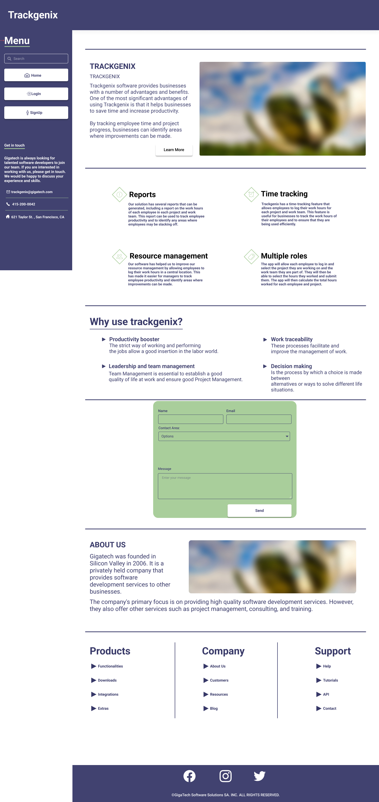

# Trackgenix
_by Fabricio Castillo_

## About this project
As an assignment for the **Become a Software Developer**  bootcamp (2022 edition) by [Radium Rocket](https://radiumrocket.com/) I, as past of a work team, set out to develop a website/web app called **Trackgenix**. This file covers that development process.

## Landing page layout

## Project Log 📆

### Week 1

- **Trackgenix**'s landing page and screen were laid out in Figma to create [demo prototypes](https://www.figma.com/proto/2t7XPyK3dineUQt2Coyxj6/UI-kit-RR-BaSP-A?node-id=653%3A1345) that could showcase the site's functionality.

- My team focused mainly on the _Employee_ and _Project Manager_ type screens. **The design and layout will be subjected to alterations and upgrade as required** by the client through feedback.

### Week 2 [[view]](https://eyrent.github.io/BaSP-A2022-Etapa1/semana-02/index.html)

- This sprint's objective is to create the initial html document for **Trackgenix**'s landing page as well as setting up this [GitHub repository](https://github.com/eyrent/BaSP-A2022-Etapa1) to track changes.

- The pieces of **text for the landing page were updated** to better reflect the look and functionality of the landing page. These were generated by a GPT-3 AI by [OpenAI](https://beta.openai.com/playground) which took commissioning information as prompt and generated short descriptions and elaborations to replace 'lorem ipsum' placeholder. Also **some words were given suitable semantic tags to improve SEO**.

- Icons were extracted from the [Figma file](https://www.figma.com/file/2t7XPyK3dineUQt2Coyxj6/UI-kit-RR-BaSP-A) used during the design and prototyping stage and included in the page. I selected two other pictures for the same use as well. However **these icons are in the darker colour version** in order to be seen when rendered by the browser without styles. They **will be updated to their light variants** when there's an appropiate background.

### Week 3 [[view]](https://eyrent.github.io/BaSP-A2022-Etapa1/semana-03/index.html)
- Our efforts were focused on styling the landing page using CSS, with the limitation of **not using neither flexbox nor CSS grids**. Therefore a combination of `display`, `position`, `float`, `margin` and `padding` properties were used to present the layout as _'pixel perfect'_ as possible.
- Some considerations were taken with respect to resolutions:
    - A viewport of `1512x850px` was used during the styling process. This was taken from the width of the frame in the Figma file and deriving the height from a 16:9 aspect ratio. This was enabled by the _Responsive Design Mode_ feature in Firefox's inspector.
    - Values for sizing and spacing were taken from the Figma file using the inspector. Special care was taken with text and headings since it was necessary to use the `line-height`property to get the exact look.
- Font is imported from Google Fonts in the `style.css` file directly.
- Changes were made in `index.html` to allow styling, e.g. adding classes, replacing img tags for some icons, adding divs.
- Also indentation was corrected, as well as element heirarchy and order in link buttons.

## Known issues 🪛

- At the moment, in Figma, there's no convenient way of showing a drop-down menu with choosable options. The dropdown menu of tasks will behave like a regular one.
- At the moment, in Figma, there's no way to alter the content of text boxes to reflect a selected/clicked option in a dropdown menu. The date selector component, specifically won't change the placeholder text in the date range fields (in _Reports_).
- The dropdown menu in the form is not styled completely. After clicking in the arrow the system styling is used, i.e. there is not special styling for the options, which kind of breaks the look 😐
- In Firefox the animations for the links in the sidebar are out of sync due to background-image transition is not supported.